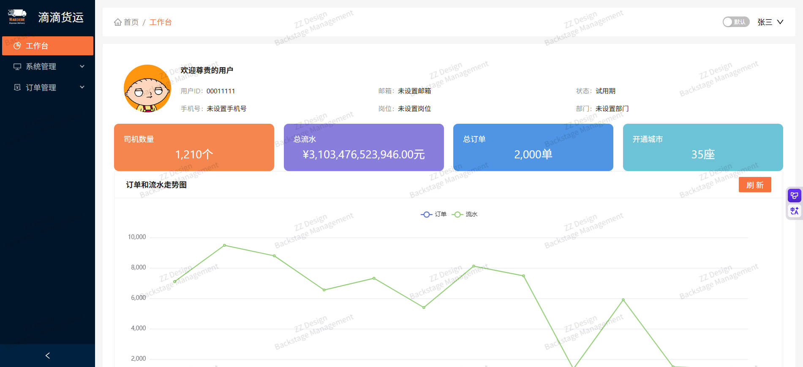
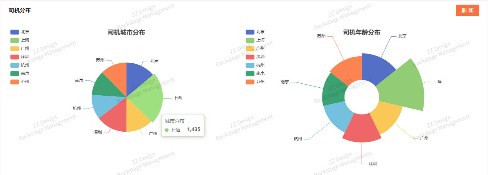
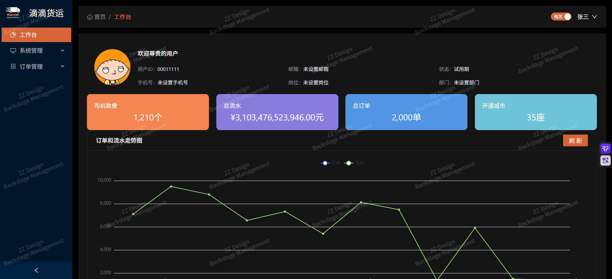
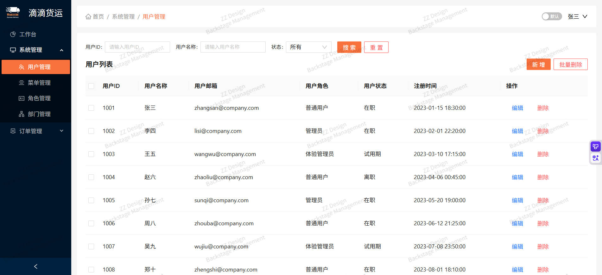
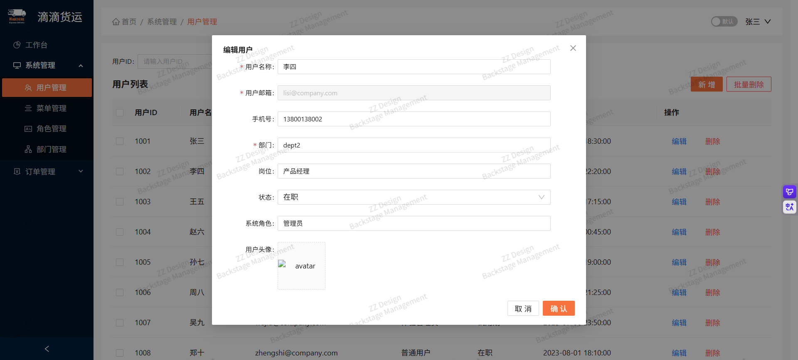
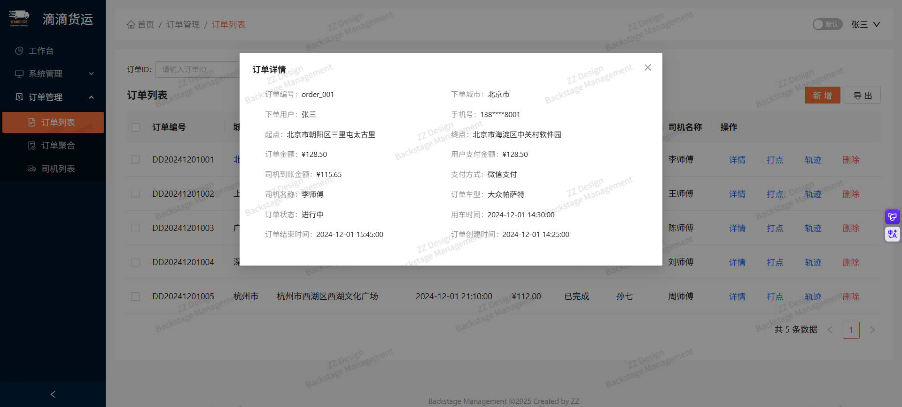
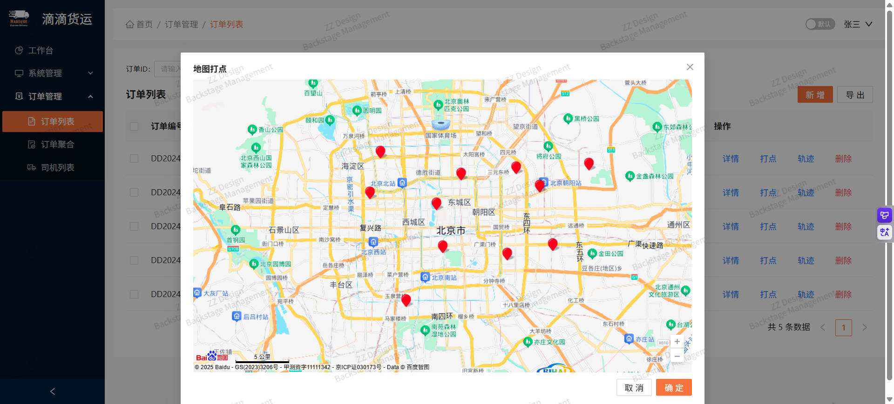
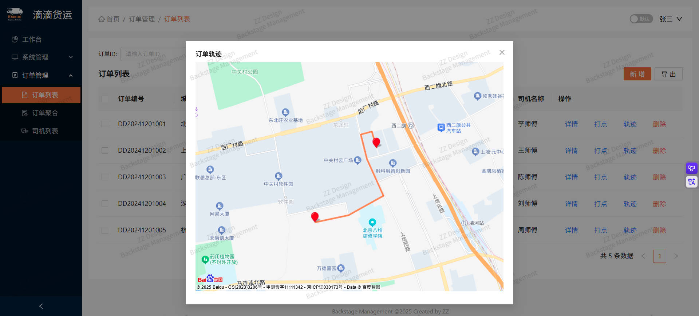
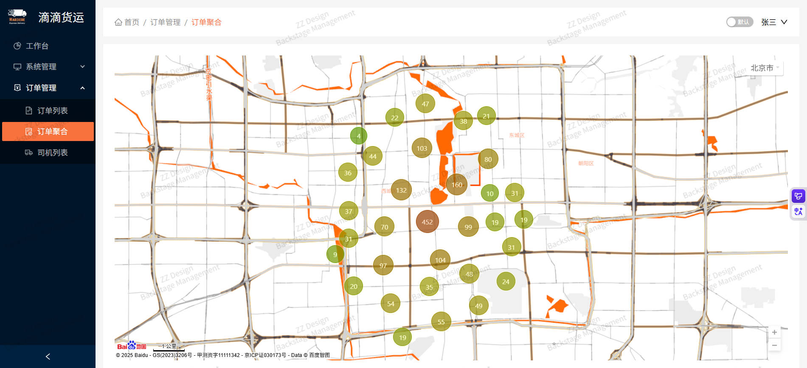
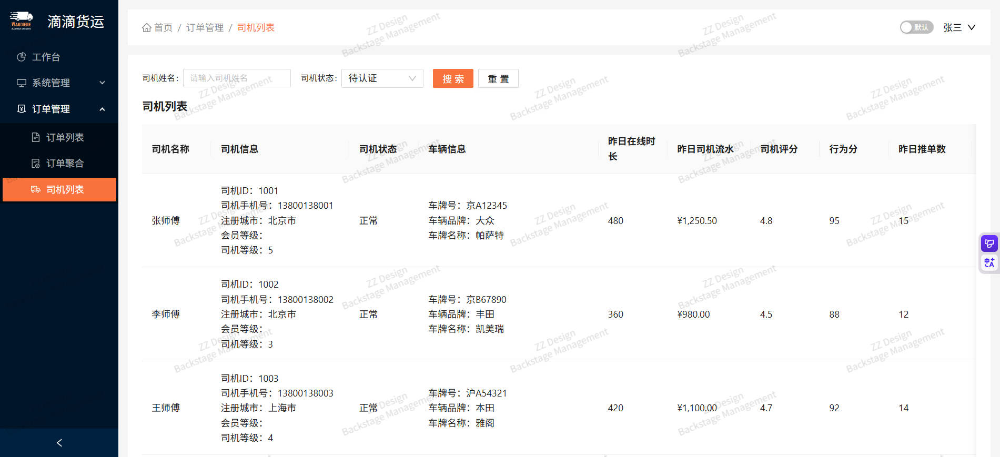

# DeliveryBSM项目

## 项目简介

这是一个服务于货运行业的通用型后台管理系统项目，项目内容包括人员、订单等统计数据的可视化呈现；支持用户、菜单、角色、部门的维护管理；订单内容的管理，支持订单详情展示、创建，提供订单路线打点服务，订单轨迹动画展示，区域内订单的聚合展示以及司机列表的维护等功能。

## 项目运行

```bash
pnpm run dev
```

## 目录结构

```
/login
/weicome
/error404
/dashboard
/userlist
/menulist
/rolelist
/deptlist
/orderlist
/ordercluster
/driverlist
```

## 页面实现

### 登录页面


### 欢迎页面


### 仪表板



### 仪表板2



### 深色主题



### 用户列表



### 创建用户



### 订单详情



### 订单标记



### 订单轨迹



### 订单聚合



### 司机列表


